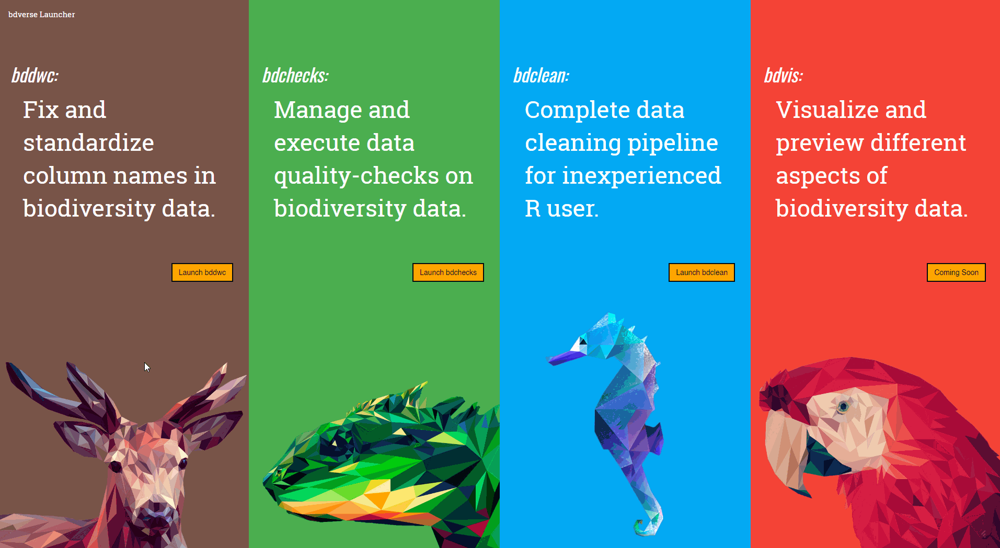

# Getting started {#start}

## Installing the bdverse

```r
install.packages("remotes")
remotes::install_github("bd-R/bdverse")
```

### <span style="color:red"> Soon: a stable version from CRAN</span>

[comment]: <> (Need-To-Be-Updated!)

```r
install.packages("bdverse")
```

## App launcher

```r
bdverse::bd_launcher()
```

```{r, echo = FALSE, fig.cap="Shiny apps launcher"}

```


## Binder

**<span style="color:red">[To try `holepunch`]</span>**

## Docker {width=22px}
### What is Docke? {-}

**<span style="color:red">[TBA]</span>**

### Docke guide

**<span style="color:red">[To link rOpenSci guide]</span>**

### Play with Docker {-}

**<span style="color:red">[TBA]</span>**

### bdverse Docker images {-}

**<span style="color:red">[TBA]</span>**

## Possible installation problems & solutions

**<span style="color:red">[ TBA ]</span>**

