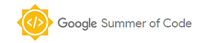

--- 
title: "bdverse: User Guide"
author: "The bdverse team"
date: "`r Sys.Date()`"
site: bookdown::bookdown_site
documentclass: book
bibliography: [book.bib]
biblio-style: apalike
link-citations: yes
github-repo: bd-R/bdverse-user-guide
url: 'https\://bd-R.github.io/bdverse-user-guide/'
description: "... TBA"
cover-image: images/under_construction.jpg
apple-touch-icon: "images/bd-R_icon.png"
apple-touch-icon-size: 120
favicon: "images/favicon.ico"
---

# {-}

{width=600px}

The bdverse: a family of R packages for biodiversity data

**--> To replace image when new graphics are ready <--**

This book is a living document. You can view updates about this user guide in the [release notes](#guidenews).

***

  This work is licensed under [a Creative Commons Attribution-NonCommercial-ShareAlike 3.0 United States License](http://creativecommons.org/licenses/by-nc-sa/3.0/us/).

{width=40px}
<a href="https://github.com/rstudio/bookdown" target="blank">  Published with bookdown   </a>
{width=40px}

# What is the `bdverse` {-}

**[To add new figure]**

The `bdverse` is a family of R packages for biodiversity data. We build it to serve as a sustainable and agile infrastructure that enhances the value of biodiversity data by allowing users to conveniently employ R, for data exploration, quality assessment, data cleaning, and standardization. The `bdverse` supports users with and **without** programming capabilities.

* `bdDwC` provides an interactive Shiny app and a set of functions for standardizing field names in compliance with Darwin Core (DwC) format, see [bdDwC section](#bdDwC).

* `bdchecks` is an infrastructure for performing, filtering, creating and managing various biodiversity data checks, see [bdchecks section](#bdchecks).

*  `bdclean` is a user-friendly data cleaning Shiny app for the **inexperienced R user**. It provides features to manage complete workflows for biodiversity data cleaning, from collecting user input in order to adjust cleaning procedures to generating various reports and versions of the data, see [bdclean section](#bdcclean).

We hope that you'll find the guide useful and clear, and welcome your suggestions in the [issue tracker of the user guide](https://github.com/bd-R/bdverse-user-guide/issues).

#### Fundings {-}

** [To add: Technion's Blumenstein Fund] **